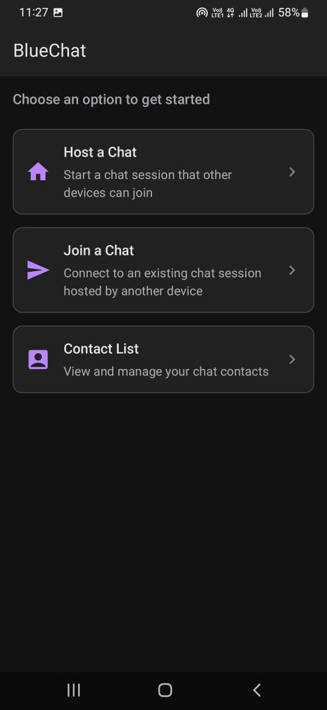
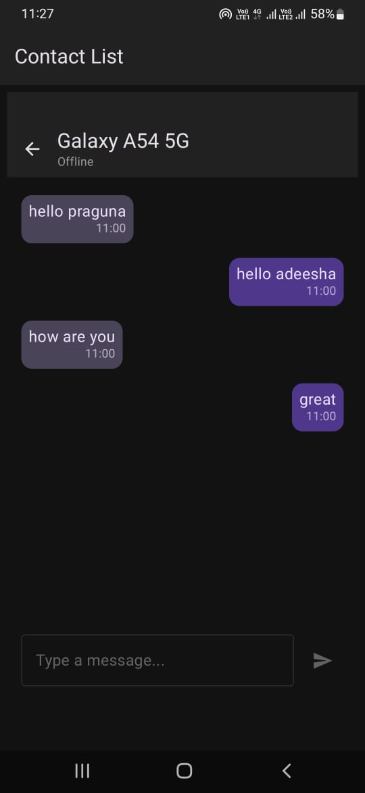
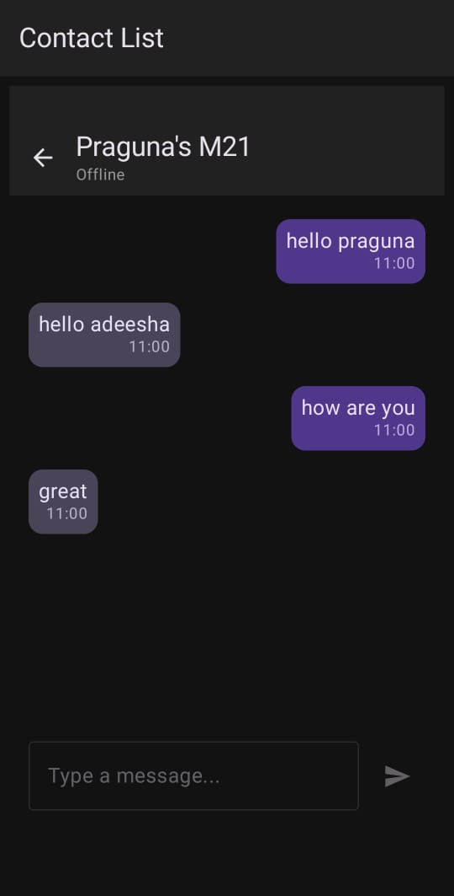

# BlueChat

BlueChat is a modern Android application that enables seamless Bluetooth Low Energy (BLE) chat between devices. It leverages BLE GATT server and client roles to discover, connect, and exchange messages, storing chat history locally using Room database. The app is built with Jetpack Compose for a beautiful, responsive UI.

## Features
- **Bluetooth LE Chat**: Discover nearby BLE devices, connect, and exchange messages in real time.
- **GATT Server & Client**: Acts as both BLE GATT server (advertising) and client (scanning/connecting).
- **Persistent Chat History**: Stores messages and device info locally using Room database.
- **Modern UI**: Built with Jetpack Compose and Material 3 for a smooth, modern experience.
- **Device Catalog**: View and manage previously connected devices.
- **Foreground Service**: Ensures reliable BLE operation even when the app is backgrounded.

## Screenshots
### Home Screen
<!--  -->

### Chat Interface
 

## Getting Started

### Prerequisites
- Android Studio Flamingo or newer
- Android device with Bluetooth LE support (API 24+)
- Gradle 8+

### Setup
1. **Clone the repository:**
2. **Open in Android Studio:**
   - Open the project directory in Android Studio.
3. **Build the project:**
   - Let Gradle sync and download dependencies.
4. **Run on a device:**
   - Use a real device (emulators typically do not support BLE).

### Permissions
The app requires the following permissions:
- `BLUETOOTH`, `BLUETOOTH_ADMIN`, `BLUETOOTH_CONNECT`, `BLUETOOTH_SCAN`, `BLUETOOTH_ADVERTISE`
- `ACCESS_FINE_LOCATION`, `ACCESS_COARSE_LOCATION` (required for BLE scanning)
- `FOREGROUND_SERVICE`, `FOREGROUND_SERVICE_CONNECTED_DEVICE`

These are declared in `AndroidManifest.xml` and requested at runtime as needed.

## Usage
1. **Launch the app.**
2. **Front Page:** Animated splash and onboarding.
3. **Device Catalog:** Browse BLE operations and demos.
4. **Find Devices:** Scan for nearby BLE devices and select one to connect.
5. **Connect & Chat:** Connect to a device, view its details, and exchange messages. Messages are saved locally.
6. **GATT Server:** The app can also act as a GATT server, advertising its presence for others to connect.

## Architecture
- **Jetpack Compose**: UI layer for all screens and navigation.
- **BLE Operations**: Located in `app/src/main/java/com/example/bluechat/ble/operations/`.
- **GATT Server**: Implemented in `app/src/main/java/com/example/bluechat/server/GATTServerService.kt`.
- **Data Layer**: Room database and repository in `app/src/main/java/com/example/bluechat/data/`.
- **Navigation**: Managed via Compose Navigation in `NavView.kt` and `CatalogScreen.kt`.
- **Dependency Injection**: Simple DI via `BlueChatApplication`.

## Dependencies
- Jetpack Compose & Material 3
- AndroidX Navigation Compose
- Room Database
- Kotlin Coroutines & Flow
- BLE APIs (android.bluetooth)

## ProGuard
Default ProGuard rules are provided. No special configuration is required unless you add custom serialization or reflection.

## Contributing
Pull requests are welcome! For major changes, please open an issue first to discuss what you would like to change.

## MIT License

Permission is hereby granted, free of charge, to any person obtaining a copy
of this software and associated documentation files (the “Software”), to deal
in the Software without restriction, including without limitation the rights
to use, copy, modify, merge, publish, distribute, sublicense, and/or sell
copies of the Software, and to permit persons to whom the Software is
furnished to do so, subject to the following conditions:

The above copyright notice and this permission notice shall be included in
all copies or substantial portions of the Software.

THE SOFTWARE IS PROVIDED “AS IS”, WITHOUT WARRANTY OF ANY KIND, EXPRESS OR
IMPLIED, INCLUDING BUT NOT LIMITED TO THE WARRANTIES OF MERCHANTABILITY,
FITNESS FOR A PARTICULAR PURPOSE AND NONINFRINGEMENT. IN NO EVENT SHALL THE
AUTHORS OR COPYRIGHT HOLDERS BE LIABLE FOR ANY CLAIM, DAMAGES OR OTHER
LIABILITY, WHETHER IN AN ACTION OF CONTRACT, TORT OR OTHERWISE, ARISING FROM,
OUT OF OR IN CONNECTION WITH THE SOFTWARE OR THE USE OR OTHER DEALINGS IN
THE SOFTWARE.
